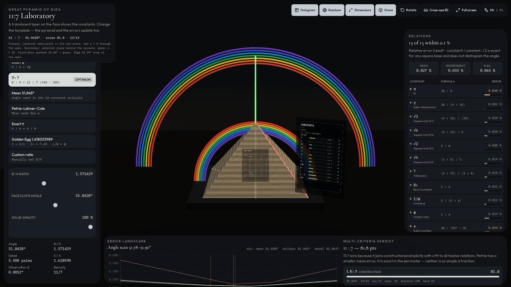
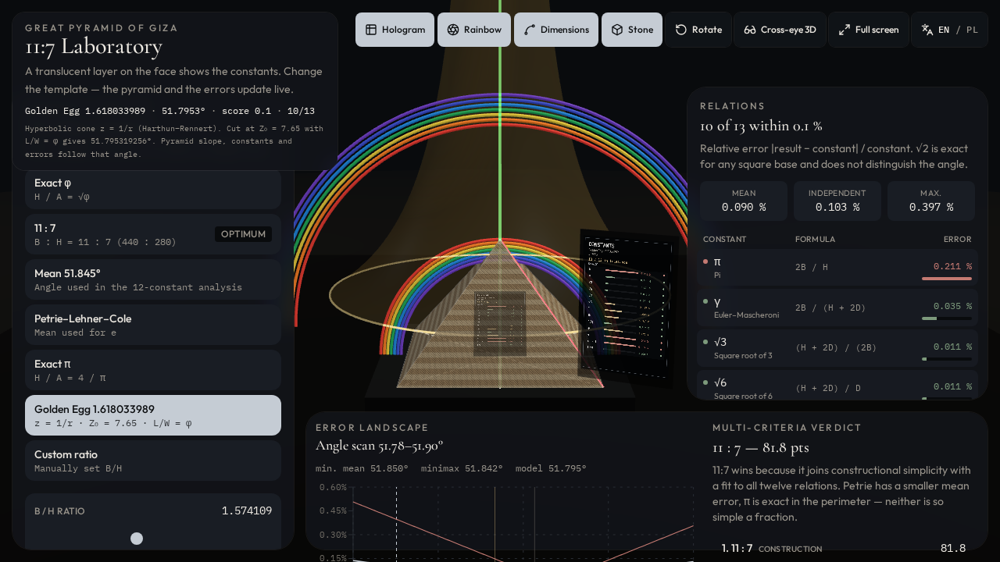

# Great Pyramid 11:7 — Mathematical Constants Laboratory

> **One proportion, a live 3D solid, a table of constant errors, a labelled rainbow correspondence, and a Golden Φ Egg cut from z = 1/r.**

[Polska wersja](README_PL.md) · [Mathematics](docs/MATHEMATICS.md) · [Golden Egg](docs/GOLDEN-EGG.md) · [Optical correspondence](docs/OPTICAL-CORRESPONDENCE.md) · [Predecessor: Fusion model](https://github.com/MichaelZP/great-pyramid-11-7)

**Open in the browser (no install):** [michaelzp.github.io/great-pyramid-11-7-lab](https://michaelzp.github.io/great-pyramid-11-7-lab/)



This repository is the **web laboratory (v2)** of the 11:7 Great Pyramid study. The Fusion 360 generator remains in a separate project: [MichaelZP/great-pyramid-11-7](https://github.com/MichaelZP/great-pyramid-11-7).

The scene is a fully parametric square pyramid from the traditional whole-number dimensions **440 × 280 royal cubits**. At a scale of **1:3200**, using an adopted royal cubit of **523.8 mm**, the model has a base side of **72.0225 mm** and, for 11:7, a height of **45.8325 mm**.

The laboratory exposes four layers without confusing them:

1. **Exact parametric geometry** — the solid is derived from 440, 280, the cubit and the scale.
2. **Comparison targets** — dimensionless expressions from the current slope are compared with established constants at a declared relative tolerance of **0.1%**.
3. **An optical correspondence diagram** — the ~42° corner inclination and 51.842773° face slope sit beside schematic primary and secondary rainbow bands.
4. **Golden Φ Egg (v2)** — a hyperbolic cone `z = 1/r` cut at `Z₀ = 7.65` so that `L/W = φ`, giving the unique plane angle **αp = 51.795319256°**. The ellipse in the cutting plane is revolved about the apothem to a translucent golden egg.

The result is a reproducible object for geometry, visualization and critical discussion — not proof of an ancient optical or mathematical encoding.

**Printable CAD geometry** (Fusion predecessor): [Thingiverse, thing:6944382](https://www.thingiverse.com/thing:6944382).

## Why this solid is remarkable

A very simple integer geometry generates an unusually rich family of close numerical relationships. The 440:280 scheme gives:

- an exact base-to-height ratio of **11:7**;
- a perimeter-to-height expression of **22:7**, the classic rational approximation of π;
- a face slope of **51.842773°**;
- a corner inclination of **41.985759°**;
- a compact set of derived lengths that can be compared with π, φ, e and other constants.

The Golden Φ Egg is a **separate** model: it does not use the rounded 51.84° cone. At `Z₀ = 7.65` the exact condition `L/W = φ` for `z = 1/r` yields **51.795319256°**. That angle drives B/H, height, and every constant error. The 51.84° cone remains a comparison model only.

## Canonical dimensions (11:7)

| Quantity | Expression | Result |
|---|---|---:|
| Adopted royal cubit | `RoyalCubit` | 523.8 mm |
| Base / height | `440 / 280` | 11 : 7 |
| Model scale | `ModelScale` | 1 : 3200 |
| Base side | `440 × 523.8 mm ÷ 3200` | 72.0225 mm |
| Vertical height | `280 × 523.8 mm ÷ 3200` | 45.8325 mm |
| Face apothem | `√(H² + A²)` | 58.287462 mm |
| Corner edge | `√(H² + B²/2)` | 68.514512 mm |
| Face slope | `atan(H / A)` | 51.842773° |
| Corner inclination | `atan(H / (D/2))` | 41.985759° |

## Models in the laboratory

| Model | Definition | Face slope |
|---|---|---:|
| Exact φ | `H / A = √φ` | 51.827292° |
| **11 : 7** | `B : H = 11 : 7` (440 : 280) | **51.842773°** |
| Mean 51.845° | angle used in the constant analysis | 51.845° |
| Petrie–Lehner–Cole | mean used for *e* | 51.8504° |
| Exact π | `H / A = 4 / π` | 51.853974° |
| Golden Φ Egg | `L/W = φ`; `z = 1/r`; `Z₀ = 7.65` | **51.795319256°** |
| Custom ratio | user `B/H` or angle | editable |

Consensus score weights (from the workbook): independent accuracy 0.35, agreement with observation 0.25, fraction simplicity 0.25, robustness in band 0.15. **11:7 remains the simplest construction model**; Golden Egg is a geometric lead, not a replacement construction. On the Golden Egg preset the laboratory engine reports **10 of 13** relations within 0.1%, with mean relative error ≈ 0.090% and maximum ≈ 0.397% (~0.4%).

## Constant comparisons (11:7, tolerance 0.1%)

Each row is derived from the current pyramid. With `MathTolerance = 0.001`, the 11:7 solid keeps the classical twelve inside 0.1%; after the exact egg integrator the thirteenth L/W row sits just outside (~0.106% relative to φ). That is 12 of 13 — not 13 of 13.

| Symbol | Formula | Target |
|---|---|---|
| π | `2B / H` | π |
| γ | `2B / (H + 2D)` | Euler–Mascheroni |
| √3 | `(H + 2D) / (2B)` | √3 |
| √6 | `(H + 2D) / D` | √6 |
| √2 | `D / B` | √2 (square base — independent of slope) |
| √5 | `(S + B) / S` | √5 |
| T | `(A + 2D) / (S + B)` | tribonacci |
| B₂ | `E / A` | Brun's constant |
| 1/φ | `S / (S + A)` | 1/φ |
| φ | `S / A` | φ |
| e | `2θ / (90° − θ)` | e |
| e − 1 | `e_model − 1` | e − 1 |
| L/W | egg length/width of `z = 1/r` at `Z₀ = 7.65` | φ at 51.795319256° |

These are **comparison formulas selected for this study**, not twelve (or thirteen) independent construction constraints. Full formulas: [docs/MATHEMATICS.md](docs/MATHEMATICS.md).

## Optical correspondence

- **Primary rainbow** — vertical semicircle in the median XZ plane, centred on the pyramid axis; outer red radius = pyramid height, so the real corner edge ends at the apex.
- **Secondary rainbow** — parallel vertical plane behind the solid, reversed colour order; the face apothem is extended and meets the green band at radius `2H`.
- Face slope **51.842773°** vs secondary green ≈ **51.83°** (difference **0.012773°**).

Display radii are schematic, not atmospheric distances. See [docs/OPTICAL-CORRESPONDENCE.md](docs/OPTICAL-CORRESPONDENCE.md).

## Golden Φ Egg



Selecting **Golden Egg 1.618033989** sets the pyramid to **51.795319256°**. Behind the solid a translucent hyperbolic cone (`r ∝ 1/z`) stands on the ground plane. The face-plane cut is a golden ellipse (`L/W = φ`); revolving that ellipse about the **apothem** produces the golden egg. With this preset the engine reports 10 of 13 relations within 0.1% and a maximum relative error of ~0.4% (about 4× the declared tolerance); 11:7 remains the construction model. Details: [docs/GOLDEN-EGG.md](docs/GOLDEN-EGG.md).

## Run in a browser

GitHub does **not** execute the Vite app from the source tree. The production build is hosted on **GitHub Pages**, so anyone can open the laboratory without cloning:

**https://michaelzp.github.io/great-pyramid-11-7-lab/**

## Run locally

Requires [Node.js](https://nodejs.org/) **20 or 22 LTS**.

```bash
git clone https://github.com/MichaelZP/great-pyramid-11-7-lab.git
cd great-pyramid-11-7-lab
npm install
npm run dev
```

Open the URL printed by Vite (port **8080**).

Production build:

```bash
npm run build
npm run preview
```

No account or database is required for the laboratory.

### Scene controls

| Control | Action |
|---|---|
| Left drag | orbit |
| Right drag / two-finger / arrows | pan (including up/down) |
| Wheel | zoom |
| **Rainbow** | primary + secondary bands and guides |
| **Dimensions** | construction lengths |
| **Stone** | limestone texture; opacity slider |
| **Cross-eye 3D** | side-by-side stereo; **Reverse depth** swaps eyes |
| **Language** | English ↔ Polish |
| Keys **1–7** | model presets |

## Source workbooks

The numerical engine follows:

- [`data/Great_Pyramid_11_7_Mathematical_Constants_Lab.xlsx`](data/Great_Pyramid_11_7_Mathematical_Constants_Lab.xlsx)
- [`data/Piramida_11_7_laboratorium_stalych.xlsx`](data/Piramida_11_7_laboratorium_stalych.xlsx)

Yellow cells in those books are inputs; blue cells are calculations. The web lab recomputes the same relations live.

## Authorship and acknowledgement

**Project concept, mathematical synthesis and authorship:** Michał Przybylski.

This web laboratory continues the Fusion model [great-pyramid-11-7](https://github.com/MichaelZP/great-pyramid-11-7).

Special thanks to **Philip Laven**, rainbow-optics specialist, whose correspondence of 1 April 2017 provided the geometrical-optics reference used here for the secondary rainbow near 525 nm (`n ≈ 1.33659`, approximately 51.83° from the anti-solar point). This acknowledgement does **not** imply that Philip Laven endorses any claim of historical intent.

Further thanks to **Rich Jarvis** for drawing attention to the pyramid/rainbow-angle relationship, and to **[Alan Green](https://tobeornottobe.org/biography/)** for publishing the mathematical-constants material used as an interpretive starting point. Acknowledgement records intellectual inspiration; it does not imply endorsement of every formula or historical conclusion.

The Harthun–Rennert hyperbolic cone `z = 1/r` and the solved cut `Z₀ = 7.65`, `L/W = φ` are used as stated in the project workbooks. Responsibility for the implementation and any remaining errors remains with the project author.

## Sources and further reading

- Predecessor: [MichaelZP/great-pyramid-11-7](https://github.com/MichaelZP/great-pyramid-11-7) — parametric Fusion 360 model
- Glen Dash and Mark Lehner, *The 2015 Survey of the Base of the Great Pyramid*, [DOI: 10.1177/030751331610200114](https://doi.org/10.1177/030751331610200114)
- Mark Lehner, *The Design of the Great Pyramid of Khufu*, [DOI: 10.1007/s00004-014-0193-9](https://doi.org/10.1007/s00004-014-0193-9)
- Philip Laven, [Simulation of rainbows, coronas, and glories by use of Mie theory](https://www.philiplaven.com/Publications/AO-42-03-p436.pdf)
- Philip Laven, [Rainbows from inhomogeneous transparent spheres: a ray-theoretic approach](https://www.philiplaven.com/Publications/JQSRT_89%282004%29257-269.pdf)
- [Math Constants — To Be or Not to Be… Opened?](https://tobeornottobe.org/the-great-pyramid-intro/math-constants/) — interpretive source for the comparison set
- [Alan Green — biography](https://tobeornottobe.org/biography/)
- [Thingiverse thing:6944382](https://www.thingiverse.com/thing:6944382) — printable 11:7 geometry
- [MakerWorld model 460194](https://makerworld.com/en/models/460194)

## Scope and responsible interpretation

- This is a **mathematical and visual model**, not a survey-grade archaeological reconstruction.
- The 523.8 mm royal cubit is an explicit adopted input.
- The 0.1% threshold is a declared comparison tolerance, not a manufacturing tolerance or a proof criterion.
- Rainbow dimensions in the scene are schematic display radii, not atmospheric distances.
- Equal-looking angles are not the same physical quantity.
- Numerical proximity alone cannot establish causal or historical intention.
- The Golden Egg construction does **not** claim that the builders encoded `z = 1/r` or a 525 nm wavelength.

## Status

Version **2.0.0**. Typecheck and production build succeed. The 3D scene (pyramid, rainbows, hyperbolic cone, revolved egg) was visually confirmed in the laboratory.

Copyright © 2026 Michał Przybylski. No open-source licence has yet been assigned.
